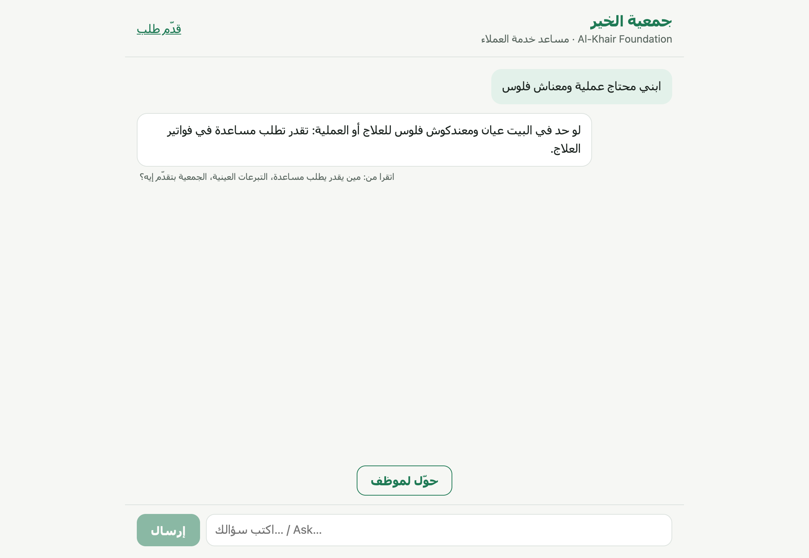
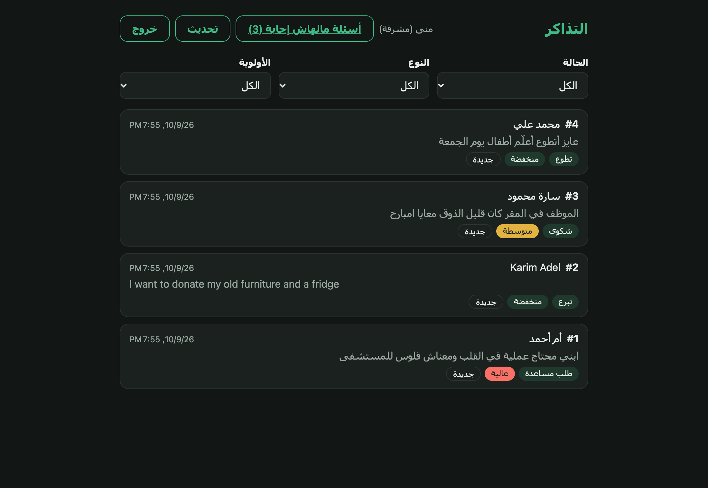
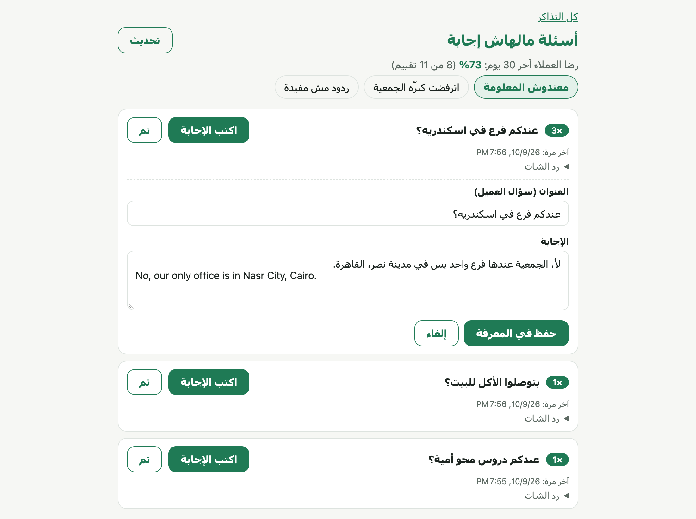
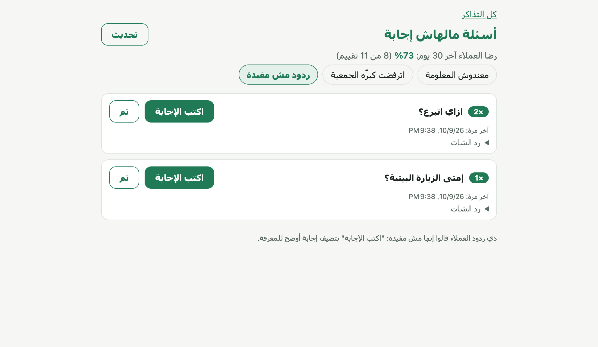
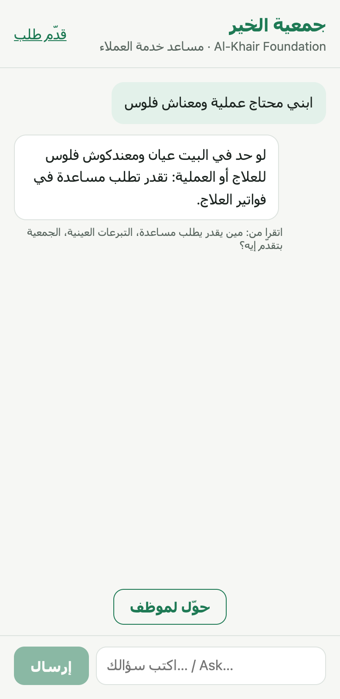

# Al-Khair Helpdesk — an AI support desk that runs on a laptop

> مساعد خدمة عملاء بالذكاء الاصطناعي لجمعية خيرية (وهمية): بيرد بالعربي والإنجليزي من ملفات الجمعية بس، وبيحوّل للموظفين، وبيتعلّم من الأسئلة اللي مكانش عارف يجاوبها. كله شغال على جهازك ببلاش من غير إنترنت.

A customer-support chat for a fictional Cairo charity, **Al-Khair Foundation**:

- It answers in **Arabic (including Egyptian) and English**, **only** from the charity's own knowledge files.
- It says "I don't know" instead of inventing.
- It hands conversations to staff as tickets.
- It shows staff which questions it could not answer, so they can teach it.

Everything runs **locally and for free**: Angular 22 + Express 5 + SQLite + [Ollama](https://ollama.com) with a 3-billion-parameter model on an 8 GB MacBook Air M1.

<p align="center">
  
</p>

| Staff: tickets classified by AI (dark mode) | Staff: questions the chat could not answer |
|---|---|
|  |  |

| Customers' 👎 and satisfaction | On a phone |
|---|---|
|  |  |

## What it does

**For customers** (`/`, `/support/new`)
- **Streaming chat:** replies appear word by word over Server-Sent Events. A Stop button cancels the model.
- **Right language every time:** the reply language is chosen in code from the customer's message, not left to the model.
- **Grounded answers:** answers come from `knowledge/*.md`. Under each reply a small line says which sections were read.
- **Escalation:** "حوّل لموظف" (talk to a person) turns the conversation into a ticket with its transcript, then shows the ticket number. A support form does the same without a chat.
- **Rating:** 👍 / 👎 under each answer from the knowledge.

**For staff** (`/staff`, login required)
- **Tickets:** classified by the model into category and priority. Staff can filter them and update status, category or priority.
- **Unanswered questions:** three tabs, each grouped and sorted by how often it was asked:
  - questions the chat could not answer;
  - questions refused as off-topic;
  - replies customers rated 👎.
  - **"اكتب الإجابة"** (write the answer) adds the answer to the knowledge, and the chat uses it **immediately, without a restart**.
  - The page also shows customer satisfaction for the last 30 days. The tickets page shows how many unanswered questions are waiting.

## How a chat message is answered

```mermaid
flowchart LR
    Q[Customer message] --> T{Small talk?<br/>code}
    Q --> G[Topic gate<br/>JSON yes/no]
    Q --> S[Search knowledge<br/>granite embeddings + cosine]
    G -->|off-topic and no close match| R1[Fixed refusal<br/>+ logged as off-topic]
    S --> A[Answerability check<br/>quote the answering line,<br/>code verifies it exists]
    A -->|not answerable| R2[Fixed "I don't know" + phone<br/>+ logged for staff]
    A -->|answerable| L[qwen2.5:3b writes the reply<br/>from the top 3 sections]
    T -->|yes| L
    L --> SSE[Streamed to the browser]
```

**Lesson learned: keep hard decisions out of the free-text answer.** A 3B model asked to "answer only from the sources, otherwise refuse" made one of two mistakes. It either invented answers ("yes, we offer literacy classes") or refused questions it could answer. Each decision now has its own small step:

| Decision | Who makes it |
|---|---|
| Reply language | Code (looks for Arabic letters) |
| Greeting or thanks | Code (word list) |
| Is this about the charity at all? | Model, JSON `{unrelated: boolean}`, ~0.4 s |
| Do the sources answer it? | Model copies the answering line; **code checks the line is really in the sources**. If this check fails, the chat refuses rather than answer unchecked |
| The reply itself | Model, only after the checks pass |

## Results (measured on the 8 GB M1)

End-to-end through `/api/chat`, on a fixed set of 26 real questions (16 answerable, 10 whose facts are not in the knowledge), one run per version:

| Version | Correct | Invented answers |
|---|---|---|
| Prompt rules only | 19–21 / 26 | 4 ("yes, literacy classes", "yes, home delivery"…) |
| + answerability check | 22 / 26 | 1 |
| **+ quote verification + FAQ-style knowledge** | **24 / 26** | **0** |

Response time:
- **First word:** about 3 s once warm.
- **First message after the models were unloaded:** 7.7 s, down from 12.6 s, on the production server.
  - Every Ollama request asks to keep the model loaded for 30 minutes.
  - The production server also loads the models and builds the index at start.

**Things that did *not* work, and are documented in the specs:**
- `qwen2.5:7b` crashed Ollama on 8 GB.
- `qwen3:4b` took 38 s per message and leaked its reasoning into replies.
- Embedding-based grouping of similar questions could not tell "university fees" from "school fees".
- A shared prompt prefix for KV-cache reuse was faster, but less accurate.

## Run it

**Requirements:** Node 24+, [Ollama](https://ollama.com).

```bash
# 1. Models (about 2.5 GB)
ollama pull qwen2.5:3b
ollama pull granite-embedding:278m
ollama serve            # keep it running

# 2. App
npm install
STAFF_EMAIL=admin@alkhair.example STAFF_PASSWORD='choose-a-password' STAFF_NAME='Admin' npm start
```

Then:
- **Chat:** http://localhost:4200
- **Staff:** http://localhost:4200/staff/login

**Production build** (warms the models up at start):

```bash
npm run build
STAFF_EMAIL=… STAFF_PASSWORD=… npm run serve:ssr:ai-helpdesk   # http://localhost:4000
```

| Variable | Default | Purpose |
|---|---|---|
| `OLLAMA_URL` | `http://localhost:11434` | Ollama server |
| `OLLAMA_MODEL` | `qwen2.5:3b` | Chat, checks and ticket classification |
| `OLLAMA_EMBED_MODEL` | `granite-embedding:278m` | Embeddings for search |
| `KNOWLEDGE_DIR` | `./knowledge` | Markdown knowledge files |
| `DB_PATH` | `./data/helpdesk.db` | SQLite database (git-ignored) |
| `ALLOWED_HOSTS` | `localhost,127.0.0.1` | Host names the production server answers to (host-header protection) |
| `STAFF_EMAIL` / `STAFF_PASSWORD` / `STAFF_NAME` | — | Creates the first staff account if it does not exist |

**Editing the knowledge:**
- Every `## Heading` in `knowledge/*.md` is one searchable section.
- Write facts the way customers ask them ("بتدفعوا الإيجار؟ لأ، …"). The small model matches and judges those far more reliably.
- Restart to pick up manual edits. Answers saved from the staff page are applied at once.

## Tests

```bash
npx ng test --watch=false   # 330 tests (Vitest), no Ollama needed
npm run build
```

- **Server:** the server logic lives in plain functions, so the tests never need Express or a running model.
- **Database:** tests use a real in-memory SQLite database. Schema changes are versioned (`PRAGMA user_version`), and a test upgrades a database made by the older version.
- **Angular:** components and services are tested with `HttpTestingController`.

## Project layout

```
src/server/          Express API, chat pipeline, SQLite repositories (one file per job)
src/app/chat/        Chat UI, SSE parsing, escalation form
src/app/staff/       Staff login, tickets, unanswered questions
knowledge/           What the assistant knows (Markdown)
docs/superpowers/    Design specs and implementation plans for every phase
docs/screenshots/    The images in this README
```

## Security notes

- **Passwords:** hashed with scrypt.
- **Logins:** an unknown email takes as long as a wrong password, so timing doesn't reveal which emails exist.
- **Sessions:** random tokens stored only as SHA-256 hashes, in `HttpOnly; SameSite=Strict` cookies.
- **Staff routes:** declared in one tested route table, so a route can't become public by accident.
- **Stored questions:** capped at 500 characters. Handled questions are deleted after 90 days.
- **Host header:** the production server only answers to `ALLOWED_HOSTS` (protection against host-header SSRF).

## Limits

- **Learning project.** No HTTPS, no rate limiting, single server.
- **Feedback is anonymous:** a 👍/👎 is not tied to a reply the server issued, and it is not rate-limited, so a script could skew the satisfaction figure.
- **Model limits:** a 3B model still occasionally refuses an answerable question (logged for staff) or mixes a foreign word into Arabic.
- **Fictional data:** the charity and every fact about it are invented.
